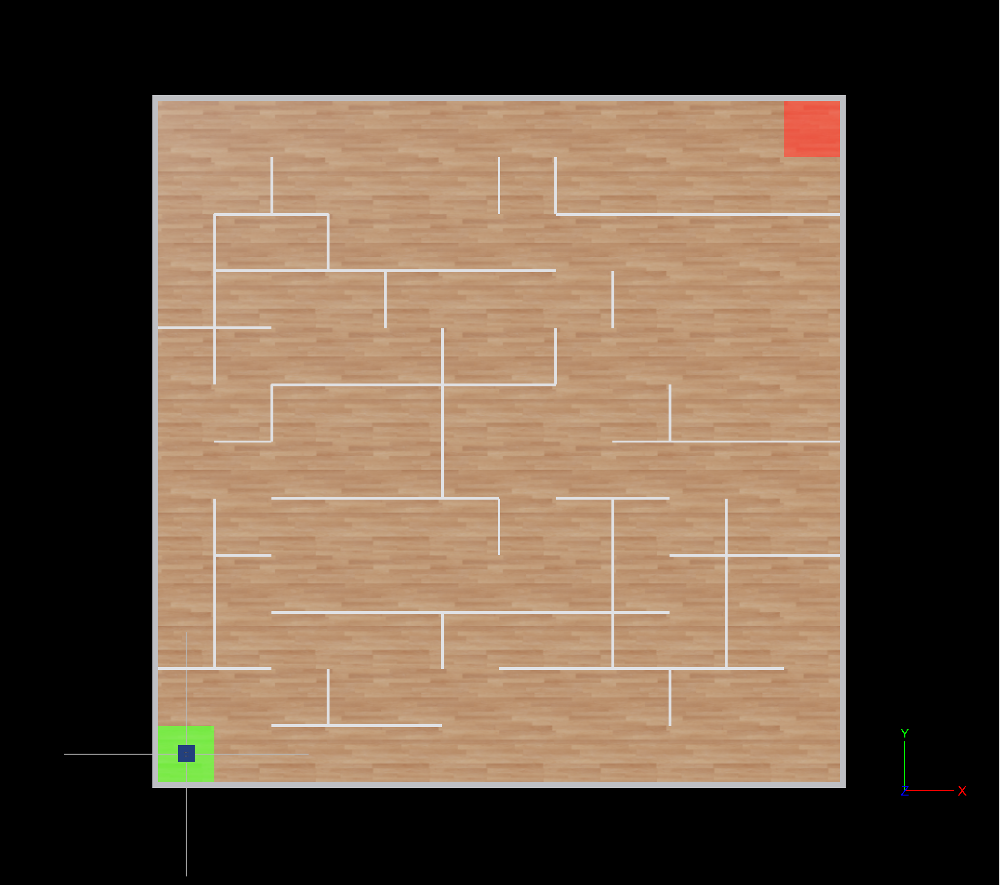

# Maze Navigation with Four-Wheel Robot
## Academic Robotics Project - Navigation Systems

This project implements advanced robot navigation algorithms for autonomous maze solving using Webots robotics simulator. The system features a sophisticated four-wheel Mecanum drive robot capable of omnidirectional movement, equipped with multiple pathfinding algorithms and comprehensive performance analysis capabilities.

**Academic Context**: This project demonstrates the integration of classical computer science algorithms with modern robotics systems, showcasing the practical implementation of graph theory, and autonomous navigation principles in a controlled maze environment.

## Project Overview

The system implements and compares multiple navigation algorithms on a custom-designed four-wheel omnidirectional robot:

- **Depth-First Search (DFS)**: Systematic graph traversal with backtracking
- **Breadth-First Search (BFS)**: Level-by-level exploration guaranteeing shortest path
- **A* Search**: Heuristic-guided optimal pathfinding with Manhattan distance
- **Flood Fill**: Distance-based exploration with gradient descent pathfinding
- **Left/Right Wall Following**: Classical maze-solving algorithms based on the hand rule
- **Smart Wall Following**: Enhanced wall following with dynamic mapping and memory
- **Advanced Motion Control**: Precision Mecanum wheel kinematics and GPS-based navigation

## Academic Significance

This project bridges theoretical computer science concepts with practical robotics implementation:

- **Algorithm Analysis**: Comparative study of pathfinding strategies
- **System Integration**: Multi-subsystem coordination (sensors, actuators, navigation)
- **Performance Evaluation**: Comprehensive metrics and academic-grade result logging
- **Real-World Application**: Practical autonomous navigation in constrained environments

## Maze


## Project Architecture

```
ms-ai-maze-runner/
├── controllers/
│   └── four_wheel_controller/           # Main robot control system
│       ├── four_wheel_controller.py     # Simplified main controller interface
│       ├── maze_robot.py                # Unified robot hardware interface
│       ├── navigation_algorithms.py     # All pathfinding algorithms
│       ├── maze_visualizer.py           # Visualization and results analysis
│       ├── config.py                    # System configuration parameters
│       └── maze_results/                # Algorithm performance results
├── worlds/
│   └── maze.wbt                         # 12x12 maze simulation environment
├── protos/
│   └── FourWheelRobot.proto            # Custom robot model definition
└── README.md                           # This documentation
```

## System Components

### Four-Wheel Mecanum Drive Robot

The robot platform is designed as an omnidirectional vehicle capable of holonomic movement in the 2D plane. This design choice enables advanced maneuverability and precise positioning essential for complex navigation algorithms.

**Key Technical Specifications:**
- **Drive System**: Four-wheel Mecanum configuration with independent motor control
- **Sensor Suite**: Four ultrasonic distance sensors positioned at cardinal directions (0°, 90°, 180°, 270°)
- **Navigation Systems**: GPS positioning with ±0.01m accuracy, digital compass for heading reference
- **Controller Architecture**: Real-time control loop with 64ms timestep for responsive behavior
- **Movement Capabilities**: 
  - Linear motion in any 2D direction without orientation change
  - In-place rotation with zero turning radius
  - Combined translational and rotational movement (holonomic motion)

**Academic Relevance**: This platform demonstrates advanced robotics principles including:
- Mecanum wheel kinematics and inverse kinematic calculations
- Multi-sensor fusion for state estimation
- Real-time control system implementation
- Holonomic motion planning and execution

## Navigation Algorithms

This project implements and analyzes seven distinct pathfinding algorithms, each representing different approaches to autonomous navigation:

### 1. Depth-First Search (DFS) Algorithm

**Theoretical Foundation**: Based on graph theory, DFS provides a systematic exploration strategy that guarantees finding a solution if one exists in a finite maze.

**Implementation Features**:
- Complete maze mapping through systematic cell exploration
- Stack-based backtracking for dead-end recovery
- Optimized path planning with redundant move elimination
- Memory-efficient visited cell tracking using set data structures

**Academic Significance**: Demonstrates fundamental computer science concepts including:
- Graph traversal algorithms and their practical applications
- Stack data structure implementation in real-world scenarios
- Systematic problem decomposition and recursive thinking
- Time complexity analysis (O(V + E) where V=vertices, E=edges)

### 2. Breadth-First Search (BFS) Algorithm

**Theoretical Foundation**: Level-by-level graph exploration guaranteeing the shortest path in unweighted graphs. Essential algorithm for optimal pathfinding.

**Implementation Features**:
- Three-phase approach: exploration, pathfinding, and execution
- Queue-based exploration ensuring shortest path discovery
- Physical robot constraints integration with sensor-based navigation
- Safe backtracking and adjacency validation for robot movement

**Academic Significance**: Core computer science algorithm demonstrating:
- Optimal pathfinding in unweighted graphs
- Queue data structure practical applications
- Level-order traversal and systematic exploration
- Guaranteed shortest path properties and proof techniques

### 3. A* Search Algorithm

**Theoretical Foundation**: Informed search algorithm using heuristic functions to guide exploration toward the goal, combining best aspects of Dijkstra's algorithm and greedy best-first search.

**Implementation Features**:
- Manhattan distance heuristic for grid-based navigation
- Priority queue with f-score (g + h) for efficient exploration
- Optimal pathfinding with reduced exploration compared to BFS
- Heuristic-guided robot movement with obstacle-aware navigation

**Academic Significance**: Advanced AI search algorithm showcasing:
- Heuristic function design and admissibility properties
- Informed vs uninformed search strategies
- A* optimality proof and implementation techniques
- Priority queue applications in pathfinding algorithms

### 4. Flood Fill Algorithm

**Theoretical Foundation**: Distance-based exploration technique that assigns distance values to cells and uses gradient descent for pathfinding. Popular in maze-solving and pixel filling applications.

**Implementation Features**:
- Four-phase approach: exploration, distance mapping, path finding, execution
- Distance gradient creation from target to all reachable cells
- Gradient descent pathfinding following steepest distance reduction
- Visual distance map for intuitive maze structure understanding

**Academic Significance**: Demonstrates spatial algorithms including:
- Distance field computation and gradient-based navigation
- Flood fill techniques in computational geometry
- Dynamic programming principles in pathfinding
- Gradient descent optimization in discrete spaces

### 5. Left Wall Following Algorithm

**Theoretical Foundation**: Classical maze-solving technique based on topological properties ensuring solution discovery in simply-connected mazes.

**Implementation Features**:
- Consistent left-hand rule application for systematic exploration
- Sensor-driven decision making with priority-based direction selection
- Robust obstacle detection and avoidance mechanisms
- State machine implementation for predictable behavior patterns

**Academic Significance**: Illustrates fundamental algorithmic concepts:
- Deterministic finite automata in practical applications
- Spatial reasoning and geometric problem solving
- Sensor fusion for environmental perception
- Rule-based system design and implementation

### 6. Right Wall Following Algorithm

**Theoretical Foundation**: Mirror implementation of left wall following, providing comparative analysis of hand-rule variations.

**Implementation Features**:
- Symmetric logic to left wall following with opposite priority system
- Identical sensor integration but reversed decision tree
- Performance comparison baseline for algorithm evaluation
- Alternative strategy for maze topologies favoring right-hand exploration

### 7. Smart Wall Following Algorithm

**Theoretical Foundation**: Enhanced wall following incorporating spatial memory and adaptive strategy selection based on exploration history.

**Implementation Features**:
- Dynamic memory system for visited cell tracking
- Intelligent backtracking when exploration reaches dead ends
- Adaptive strategy switching between different wall-following modes
- Performance optimization through learned behavior patterns

**Academic Significance**: Demonstrates advanced concepts:
- Memory-augmented algorithms and their performance benefits
- Adaptive artificial intelligence in constrained environments
- Exploration vs. exploitation trade-offs in search strategies
- Dynamic algorithm modification based on environmental feedback

## System Architecture

### Core Software Modules

The system is architected using modular design principles with a simplified, consolidated structure that separates concerns across specialized components:

#### 1. Main Controller (`four_wheel_controller.py`)
- **Purpose**: Simplified entry point providing clean interface for maze navigation
- **Features**: Algorithm selection, initialization coordination, result management
- **Academic Value**: Demonstrates clean API design and system orchestration principles

#### 2. Unified Robot Interface (`maze_robot.py`)
- **Purpose**: Consolidated hardware abstraction integrating all robot functionality
- **Features**: 
  - Integrated Mecanum wheel kinematics and motor control
  - Built-in GPS-based position tracking and coordinate conversion
  - Unified sensor management and wall detection
  - Cell-based movement commands for simplified navigation
- **Academic Value**: Showcases hardware abstraction, sensor fusion, and system integration

#### 3. Navigation Algorithms (`navigation_algorithms.py`)
- **Purpose**: Centralized collection of all pathfinding strategies
- **Features**: DFS, BFS, A*, Flood Fill, left/right wall following, smart wall following algorithms
- **Academic Value**: Clear separation of algorithm logic from hardware concerns and comprehensive algorithm comparison

#### 4. Visualization and Analysis (`maze_visualizer.py`)
- **Purpose**: Comprehensive result analysis and performance visualization
- **Features**: 
  - Real-time progress tracking with enhanced ASCII visualization
  - Academic-grade performance metrics and statistical analysis
  - Automated result logging with timestamp-based file management
  - Comparative algorithm analysis and reporting
- **Academic Value**: Data visualization, performance analysis, and research methodology

#### 5. Configuration Management (`config.py`)
- **Purpose**: Centralized parameter management for system-wide consistency
- **Features**: Physical constants, sensor thresholds, timing parameters, performance tuning values
- **Academic Value**: Software engineering best practices and maintainable code design

## Experimental Environment

### Maze Configuration
- **Dimensions**: 12×12 cell grid representing 144 discrete navigable positions
- **Physical Scale**: Each cell represents 1m² in the simulation environment
- **Boundary Conditions**: Enclosed environment with defined entry and exit points
- **Starting Position**: Southwest corner (0,0) - standardized initial conditions
- **Target Location**: Northeast corner (11.5, 11.5) - diagonal traversal requirement
- **Obstacle Pattern**: Complex wall configuration designed to test various algorithmic approaches

### Performance Metrics
- **Path Length**: Total distance traveled measured in simulation units
- **Exploration Efficiency**: Ratio of optimal path to actual path taken
- **Time to Completion**: Real-time duration from start to goal achievement
- **Cell Coverage**: Percentage of maze explored during navigation
- **Backtracking Frequency**: Number of revisited cells indicating algorithm efficiency

### Running Academic Simulations

#### Basic Algorithm Testing:
1. Launch Webots simulator
2. Open world file: `File → Open World → maze.wbt`
3. Verify robot controller assignment in robot properties
4. Execute simulation with Play button
5. Monitor algorithm performance through console output

#### Simplified Algorithm Selection:

The refactored system provides a clean, simplified interface for running different algorithms:

```python
# Initialize the simplified maze controller
controller = MazeController()
controller.initialize()
controller.wait_for_gps()

# Run individual algorithms
controller.run_dfs()                    # Depth-First Search
controller.run_bfs()                    # Breadth-First Search (shortest path)
controller.run_astar()                  # A* Search (heuristic-guided optimal)
controller.run_flood_fill()             # Flood Fill (distance-based optimal)
controller.run_left_wall_following()    # Left wall following
controller.run_right_wall_following()   # Right wall following  
controller.run_smart_wall_following()   # Enhanced wall following
controller.stop()
```

#### Comparative Analysis:
1. Use the simplified interface to run multiple algorithms automatically
2. Execute multiple runs for statistical analysis using the built-in comparison tools
3. Review automated performance logs in `maze_results/` directory
4. Analyze comparative metrics through the enhanced visualization system

#### Advanced Configuration:
- **Maze Modification**: Edit `maze.wbt` for custom maze layouts
- **Parameter Tuning**: Adjust values in `config.py` for performance optimization
- **Sensor Calibration**: Modify sensor thresholds based on environmental conditions

## Academic Analysis and Results

### Enhanced Performance Evaluation Framework

The refactored system includes significantly improved performance logging and analysis capabilities designed for comprehensive academic evaluation:

**Automated Result Generation:**
- Real-time performance metrics logging to `maze_results/` directory with enhanced detail
- Timestamp-based file naming for systematic experiment tracking
- Detailed algorithm execution traces with decision point analysis and visualization
- Statistical summaries including path efficiency, completion times, and coverage analysis
- Enhanced ASCII visualization with progress tracking and comparative displays

**Advanced Comparative Analysis Metrics:**
- **Path Optimality**: Ratio of achieved path length to theoretical minimum
- **Exploration Efficiency**: Percentage of maze area explored relative to solution requirement
- **Algorithmic Complexity**: Computational overhead and memory usage analysis
- **Coverage Analysis**: Real-time tracking of maze exploration progress
- **Robustness Testing**: Performance under varying environmental conditions
- **Multi-Algorithm Comparison**: Side-by-side performance analysis with statistical summaries

**New Visualization Features:**
- Enhanced real-time progress visualization during navigation
- Comprehensive result analysis with academic-grade reporting
- Automated comparison reports for multiple algorithm runs
- Performance timing and execution analysis tools

### Expected Academic Outcomes

**Algorithm Performance Hierarchy** (based on maze complexity and optimality):
1. **BFS/A*/Flood Fill**: Optimal path algorithms - guaranteed shortest path with different efficiency characteristics
2. **DFS**: Complete exploration algorithm - finds solution but may not be optimal
3. **Smart Wall Following**: Adaptive algorithm with memory - balanced performance with learning capabilities
4. **Left/Right Wall Following**: Deterministic rule-based algorithms - consistent but potentially suboptimal

## Future Research Directions

### Immediate Extensions
- **Multi-Robot Coordination**: Implement swarm behavior with multiple autonomous agents using the modular architecture
- **Dynamic Environments**: Add moving obstacles and changing maze configurations leveraging the unified robot interface
- **Machine Learning Integration**: Implement reinforcement learning for policy optimization using the separated algorithm framework
- **Enhanced SLAM Implementation**: Extend position tracking for simultaneous localization and mapping capabilities

**Common Issues and Solutions:**
- **Controller Assignment**: Verify robot controller in Webots Robot Properties panel
- **Sensor Calibration**: Adjust sensor thresholds in `config.py` for different environments
- **Performance Optimization**: Modify `TIME_STEP` and `MAX_SPEED` for system-specific tuning
- **Memory Limitations**: Implement result file cleanup for extended experimental runs using the automated file management system

**Simplified Interface Benefits:**
- **Easier Debugging**: The consolidated `MazeRobot` class provides unified hardware access for troubleshooting
- **Cleaner Algorithm Testing**: Use the separated `NavigationAlgorithms` class to isolate algorithm-specific issues
- **Enhanced Logging**: The improved `MazeVisualizer` provides more detailed error reporting and progress tracking

**Debug Mode Activation:**
Enable detailed logging by setting `DEBUG_MODE = True` in `config.py` for:
- Real-time sensor value monitoring through the unified robot interface
- Algorithm decision trace logging via the enhanced visualization system
- Performance metric calculation verification with detailed timing analysis
- System state debugging information across all consolidated modules

## License and Academic Use

This project is released under the MIT License, encouraging academic use and modification. The codebase is specifically designed for educational purposes and academic research in robotics and artificial intelligence.

**Citation Recommendation:**
When using this project for academic purposes, please reference:
- Webots robotics simulator platform
- Specific algorithms implemented (DFS, BFS, A*, Flood Fill, Wall Following variants)
- Mecanum wheel kinematics implementation
- Academic documentation methodology demonstrated
- Comparative pathfinding algorithm analysis framework
